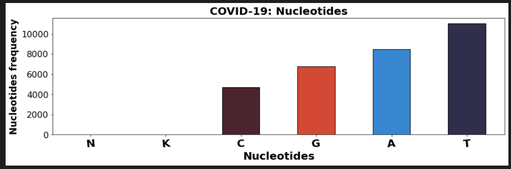
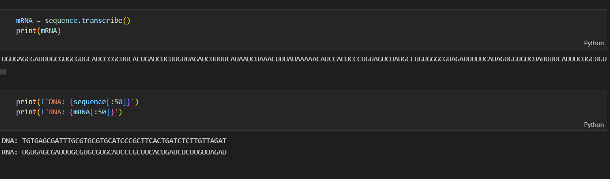
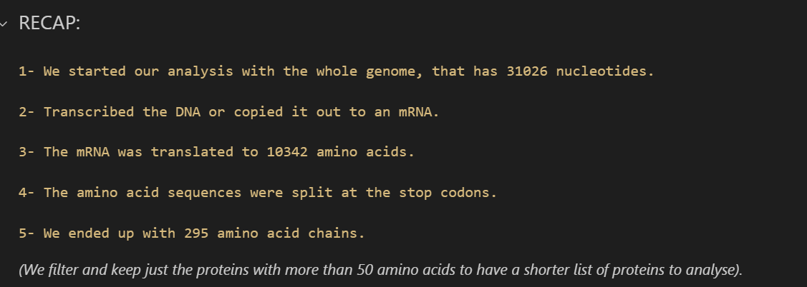
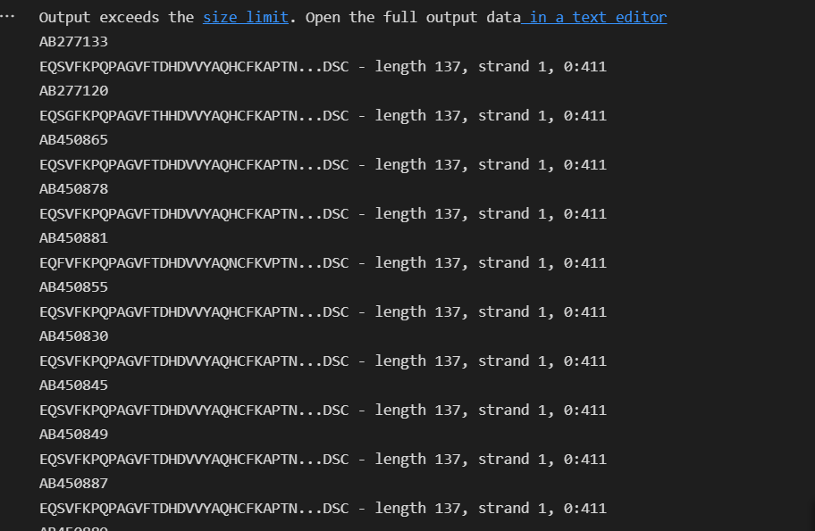

# uas-bioinfor

KELOMPOK 1 BIOINFORMATIKA

Anggota Kelompok 1 :
1. Abdul Hafidh (2008107010056)
2. Haris Daffa (2008107010059)
3. Khairul Umam Albi (2008107010072)
4. Teuku Nabil Muhammad Dhuha (2008107010004)
5. Yoan Rifqi Candra (2008107010029)

# Pengertian Virus COVID-19
Virus Corona atau severe acute respiratory syndrome coronavirus 2 (SARS-CoV-2) adalah virus yang menyerang sistem pernapasan
Sebagian besar orang yang tertular COVID-19 akan mengalami gejala ringan hingga sedang, dan akan pulih tanpa penanganan khusus. Namun, sebagian orang akan mengalami sakit parah dan memerlukan bantuan medis.

Selain virus SARS-CoV-2 atau virus Corona, virus yang termasuk dalam kelompok Coronavirus adalah virus penyebab Severe Acute Respiratory Syndrome (SARS) dan virus penyebab Middle-East Respiratory Syndrome (MERS).

Infeksi virus Corona yang disebut COVID-19 (Corona Virus Disease 2019) pertama kali ditemukan di kota Wuhan, China pada akhir Desember 2019. Virus ini menular dengan sangat cepat dan menyebar ke hampir semua negara, termasuk Indonesia, hanya dalam waktu beberapa bulan.

Virus dapat menyebar dari mulut atau hidung orang yang terinfeksi melalui partikel cairan kecil ketika orang tersebut batuk, bersin, berbicara, bernyanyi, atau bernapas. Partikel ini dapat berupa droplet yang lebih besar dari saluran pernapasan hingga aerosol yang lebih kecil.

# Informasi Genetik
Pada bagian ini, kami menempailkan berbagai macam informasi genetik dari virus COVID-19 seperti panjang sequence dari virus tersebut dan hasilnya adalah ada 52.763.761 (lima puluh dua juta tujuh ratus enam puluh tiga ribu tujuh ratus enam puluh satu) panjang sequencenya. Kemudian, kami simpan data yang telah diperoleh. Setelah itu, kami menampilkan jumlah karakter basa nukleotida ATGC dari virus corona yaitu:      
  -> Adenine (A), berjumlah 14.367.759 (empat belas juta tiga ratus enam puluh tujuh ribu tujuh ratus lima puluh sembilan)      
  -> Thymine (T), berjumlah 17.496.106 (tujuh belas juta empat ratus sembilan puluh enam ribu seratus enam)      
  -> Guanine (G), berjumlah 11.046.422 (sebelas juta empat puluh enam ribu empat ratus dua puluh dua)     
  -> Cytosine (C), berjumlah 343 (tiga ratus empat puluh tiga)      
Setelah diperoleh jumlah karakter dari setiap karakter basa ATGC. Maka, selanjutnya adalah kami menvisualisasikannya dengan menggunakan barchart.
Dan diperoleh kesimpulan bahwa karakter basa Thymine (T) memiliki jumlah karakter terbanyak dan diikuti oleh karakter basa Adenine (A), Guanine (G), dan Cytosine (C).

Adapun karakter yang terdapat pada nukleotida DNA adalah AGTCKN, dengan jumlah setiap karakter adalah sebagai berikut:      
  -> T : 11.034 (sebelas ribu tiga puluh empat)     
  -> G : 6.765 (enam ribu tujuh ratus enam puluh lima)      
  -> A : 8.490 (delapan ribu empat ratus sembilan puluh)      
  -> C : 4.734 (empat ribu tujuh ratus tiga puluh empat)      
  -> K : 2 (dua)    
  -> N : 1 (satu)   
Dari jumlah setiap karakter yang terdapat pada nukleotida DNA maka diperoleh hasil bahwa karakter T memiliki frekuensi terbanyak diikuti dengan karakter A, G, C, K, dan N.

<h2 align="center">
  
   
</h2>

# Transkripsi
transkripsi adalah pembuatan RNA terutama mRNA dengan menyalin sebagian berkas DNA oleh enzim RNA polimerase. Proses transkripsi menghasilkan mRNA dari DNA di dalam sel yang menjadi langkah awal sintesis protein. Transkripsi merupakan bagian dari rangkaian ekspresi genetik.

Proses yang kami lakukan selanjutnya adalah melakukan transkripsi pada data genetik corona virus dengan menampilkan sequence DNA dan RNA.

<h2 align="center">
  
   
</h2>

# Translasi
Setelah dilakukannya transkripsi kami melakukan proses translasi, yaitu proses penerjemahan urutan nukleotida yang ada pada molekul mRNA menjadi rangkaian asam-asam amino yang menyusun suatu polipeptida atau protein.

Pada proses translasi kami menampilkan asam amino yang terdapat pada virus corona dan hasilnya terdapat 10.342 (sepuluh ribu tiga ratus empat puluh dua) asam amino. Selain itu, kami juga memiliki 295 (dua ratus sembilan puluh lima) dan Kami memiliki 16 (enam belas) protein dengan lebih dari 50 (lima puluh) asam amino dalam genom

<h2 align="center">
  
   
</h2>

# Frames

 reading frames atau membaca kerangak adalah  cara membagi urutan nukleotida dalam molekul asam nukleat (DNA atau RNA) menjadi serangkaian triplet yang berurutan dan tidak tumpang tindih. Dimana kembar tiga ini sama dengan asam amino atau menghentikan sinyal selama translasi, mereka disebut kodon.

 Open reading frame (ORF) adalah reading frames yang berpotensi untuk mentranskripsikan menjadi RNA dan diterjemahkan menjadi protein. Dalam hal ini membutuhkan urutan DNA yang berkelanjutan dari kodon awal melalui wilayah berikutnya yang biasanya memiliki panjang yang merupakan kelipatan dari 3 nukleotida, ke kodon stop dalam kerangka pembacaan yang sama.

<h2 align="center">
  
   
</h2>
